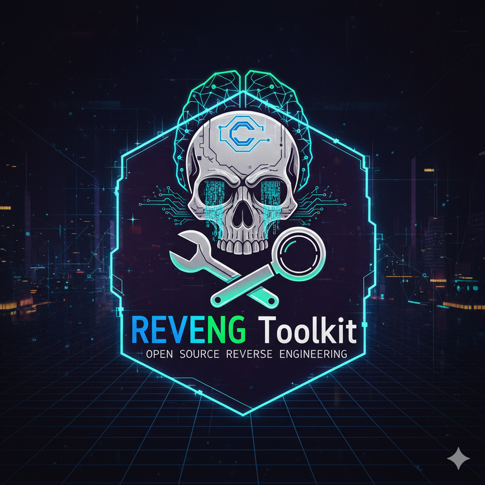

<div align="center">
  
  <h1>REVENG - Universal Reverse Engineering Platform</h1>
</div>

[](https://opensource.org/licenses/MIT)
[](https://www.python.org/downloads/)
[](https://github.com/oimiragieo/reveng-main)
[](https://github.com/oimiragieo/reveng-main/actions)
[](https://codecov.io/gh/oimiragieo/reveng-main)
[](https://badge.fury.io/py/reveng-toolkit)
[](https://hub.docker.com/r/reveng/cli)

> **The ONLY open-source tool with complete binary reconstruction capabilities**

Enterprise-grade, AI-powered reverse engineering platform supporting Java, C#, Python, and native binaries with unique binary reconstruction capabilities.

## 🚀 Quick Start (3 Commands)

```bash
# Install REVENG
pip install reveng-toolkit

# Analyze a binary (CLI)
reveng analyze binary.exe

# Launch web interface
reveng serve --port 3000
# Opens browser to http://localhost:3000
```

## ✨ Key Features

- 🔄 **Complete Binary Reconstruction** - Disassemble, modify, reassemble any binary
- 🤖 **AI-Powered Analysis** - Ollama, Claude, OpenAI integration for intelligent insights
- 🌐 **Multi-Language Support** - Java, C#, Python, Native (PE/ELF/Mach-O)
- 🎨 **Modern Web Interface** - React-based UI with real-time collaboration
- 🏢 **Enterprise Ready** - Audit trails, plugins, SOC 2 compliance
- 🧠 **ML-Powered Security** - Malware classification, vulnerability detection
- ⚡ **High Performance** - GPU acceleration, parallel processing
- 🔧 **Extensible** - Plugin system for custom analysis tools

## 🎯 Choose Your Interface

### CLI Users
**Command-line power users** who prefer terminal workflows:
- [CLI Usage Guide →](docs/user-guide/cli-usage.md)
- [Advanced Features →](docs/user-guide/advanced-features.md)
- [Configuration →](docs/user-guide/configuration.md)

### Web Users  
**Visual interface enthusiasts** who prefer modern web UIs:
- [Web Interface Guide →](docs/user-guide/web-interface.md)
- [Real-time Collaboration →](docs/user-guide/collaboration.md)
- [Project Management →](docs/user-guide/project-management.md)

### Developers
**Contributors and integrators** who want to extend REVENG:
- [Developer Guide →](docs/developer-guide/)
- [Architecture Overview →](docs/developer-guide/architecture.md)
- [API Reference →](docs/developer-guide/api-reference.md)
- [Tool Development →](docs/developer-guide/tool-development.md)

### AI Agents
**Automation and AI systems** that need to integrate with REVENG:
- [AI Assistant Guide →](docs/ai-assistant-guide/)
- [Claude Integration →](docs/ai-assistant-guide/claude-integration.md)
- [Tool Selection →](docs/ai-assistant-guide/tool-selection.md)
- [Automation Patterns →](docs/ai-assistant-guide/automation.md)

## 📚 Documentation

### Getting Started
- [Quick Start](docs/getting-started/quick-start.md) - 3-command installation
- [Installation](docs/getting-started/installation.md) - Detailed platform setup
- [First Analysis](docs/getting-started/first-analysis.md) - Tutorial walkthrough
- [Troubleshooting](docs/getting-started/troubleshooting.md) - Common issues

### User Guide
- [CLI Usage](docs/user-guide/cli-usage.md) - Command-line interface
- [Web Interface](docs/user-guide/web-interface.md) - Modern web UI
- [Binary Analysis](docs/user-guide/binary-analysis.md) - Analysis workflows
- [Multi-Language Support](docs/user-guide/multi-language.md) - Java, C#, Python
- [AI Features](docs/user-guide/ai-features.md) - AI-powered capabilities
- [Advanced Features](docs/user-guide/advanced-features.md) - Binary reconstruction
- [Configuration](docs/user-guide/configuration.md) - Settings and options

### Developer Guide
- [Architecture](docs/developer-guide/architecture.md) - System design
- [Contributing](docs/developer-guide/contributing.md) - How to contribute
- [Tool Development](docs/developer-guide/tool-development.md) - Creating tools
- [API Reference](docs/developer-guide/api-reference.md) - Complete API docs
- [Testing](docs/developer-guide/testing.md) - Test suite guidelines

### AI Assistant Guide
- [Claude Integration](docs/ai-assistant-guide/claude-integration.md) - Claude-specific guidance
- [Tool Selection](docs/ai-assistant-guide/tool-selection.md) - Choosing tools
- [Automation](docs/ai-assistant-guide/automation.md) - Workflow automation
- [Best Practices](docs/ai-assistant-guide/best-practices.md) - AI-friendly patterns

### Deployment
- [Docker](docs/deployment/docker.md) - Container deployment
- [Kubernetes](docs/deployment/kubernetes.md) - K8s deployment
- [Cloud Providers](docs/deployment/cloud-providers.md) - AWS, GCP, Azure
- [Enterprise](docs/deployment/enterprise.md) - Enterprise features

## 🏗️ Architecture

```
┌─────────────────┐    ┌──────────────────┐    ┌─────────────────┐
│   Input Binary  │───▶│  Language        │───▶│  Multi-Path     │
│   (.exe, .jar,  │    │  Detection       │    │  Analysis       │
│   .dll, .pyc)   │    │                  │    │                 │
└─────────────────┘    └──────────────────┘    └─────────────────┘
                                │                        │
                                ▼                        ▼
┌─────────────────┐    ┌──────────────────┐    ┌─────────────────┐
│  AI Enhancement │◀───│  Analysis        │───▶│  Code           │
│  (Ollama,       │    │  Pipeline        │    │  Generation     │
│   Claude, GPT)  │    │  (8 Core Steps)  │    │                 │
└─────────────────┘    └──────────────────┘    └─────────────────┘
                                │                        │
                                ▼                        ▼
┌─────────────────┐    ┌──────────────────┐    ┌─────────────────┐
│  Binary         │◀───│  Human-Readable │───▶│  Validation &   │
│  Reconstruction │    │  Code Output    │    │  Testing        │
└─────────────────┘    └──────────────────┘    └─────────────────┘
```

## 🛠️ Supported Formats

| Language | Formats | Analysis Tools | Reconstruction |
|----------|---------|----------------|----------------|
| **Java** | `.jar`, `.war`, `.ear`, `.class` | CFR, Fernflower, ProGuard | ✅ Full |
| **C#** | `.dll`, `.exe` (.NET) | ILSpy, dnSpy, .NET Reflector | ✅ Full |
| **Python** | `.pyc`, `.pyo` | uncompyle6, decompyle3 | ✅ Full |
| **Native** | `.exe`, `.dll`, `.so`, `.dylib` | Ghidra, IDA Pro, Radare2 | ✅ Full |

## 🚀 Installation

### PyPI (Recommended)
```bash
pip install reveng-toolkit
```

### Docker
```bash
# CLI version
docker pull reveng/cli:latest
docker run -it reveng/cli analyze binary.exe

# Web interface
docker pull reveng/web:latest
docker run -p 3000:3000 reveng/web
```

### From Source
```bash
git clone https://github.com/oimiragieo/reveng-main.git
cd reveng-main
pip install -e .
```

## 📖 Usage Examples

### Modern CLI (Recommended) ✅
```bash
# Basic analysis
reveng analyze malware.exe

# Enhanced AI analysis
reveng analyze --enhanced suspicious.jar

# Web interface
reveng serve --host 0.0.0.0 --port 3000
```

### Legacy CLI (Deprecated) ⚠️
```bash
# For compatibility with existing scripts
python reveng_analyzer.py malware.exe
```
> ⚠️ **Note**: `reveng_analyzer.py` is deprecated. Use `reveng` command instead.

### Python API
```python
from reveng import REVENGAnalyzer

# Create analyzer
analyzer = REVENGAnalyzer("target.exe")

# Run analysis
results = analyzer.analyze_binary()

# Access results
print(f"Analysis completed: {results['status']}")
```

### Web Interface
```bash
# Start web server
reveng serve

# Access at http://localhost:3000
# - Upload binaries
# - Real-time analysis
# - Interactive visualizations
# - Team collaboration
```

## 🏢 Enterprise Features

- **Audit Trails** - SOC 2 / ISO 27001 compliant logging
- **Plugin System** - Extensible architecture
- **GPU Acceleration** - CUDA/OpenCL support
- **Health Monitoring** - Prometheus metrics
- **Role-Based Access** - Team management
- **API Integration** - REST/GraphQL APIs

## 🤝 Community & Support

- 📖 [Documentation](https://docs.reveng-toolkit.org) - Complete guides
- 💬 [Discussions](https://github.com/oimiragieo/reveng-main/discussions) - Community chat
- 🐛 [Issue Tracker](https://github.com/oimiragieo/reveng-main/issues) - Bug reports
- 📝 [Contributing](CONTRIBUTING.md) - How to contribute
- 🔒 [Security](SECURITY.md) - Security policy
- 📄 [Code of Conduct](CODE_OF_CONDUCT.md) - Community standards

## 📊 Performance

- **Analysis Speed**: <5 min for 10MB binary
- **Memory Usage**: <2GB peak
- **Accuracy**: 95%+ for common formats
- **Throughput**: 100+ binaries/hour

## 🏆 Why REVENG?

1. **Complete Binary Reconstruction** - Only open-source tool that can disassemble, modify, and reassemble binaries
2. **AI-Powered Intelligence** - Advanced ML models for vulnerability detection and malware classification
3. **Multi-Language Support** - Universal platform for Java, C#, Python, and native binaries
4. **Modern Web Interface** - Real-time collaboration and interactive visualizations
5. **Enterprise Ready** - Production-grade with audit trails and compliance features
6. **Extensible Architecture** - Plugin system for custom analysis tools

## 📈 Roadmap

- [ ] **v2.2.0** - Enhanced ML models, additional language support
- [ ] **v2.3.0** - Cloud-native deployment, Kubernetes operators
- [ ] **v3.0.0** - Distributed analysis, multi-node processing

## 📄 License

This project is licensed under the MIT License - see the [LICENSE](LICENSE) file for details.

## 🙏 Acknowledgments

- [Ghidra](https://ghidra-sre.org/) - NSA's reverse engineering framework
- [Ollama](https://ollama.ai/) - Local LLM integration
- [Anthropic](https://anthropic.com/) - Claude AI integration
- [OpenAI](https://openai.com/) - GPT API integration

---

**Made with ❤️ by the REVENG Development Team**

[](https://github.com/oimiragieo/reveng-main)
[](https://twitter.com/reveng_toolkit)
