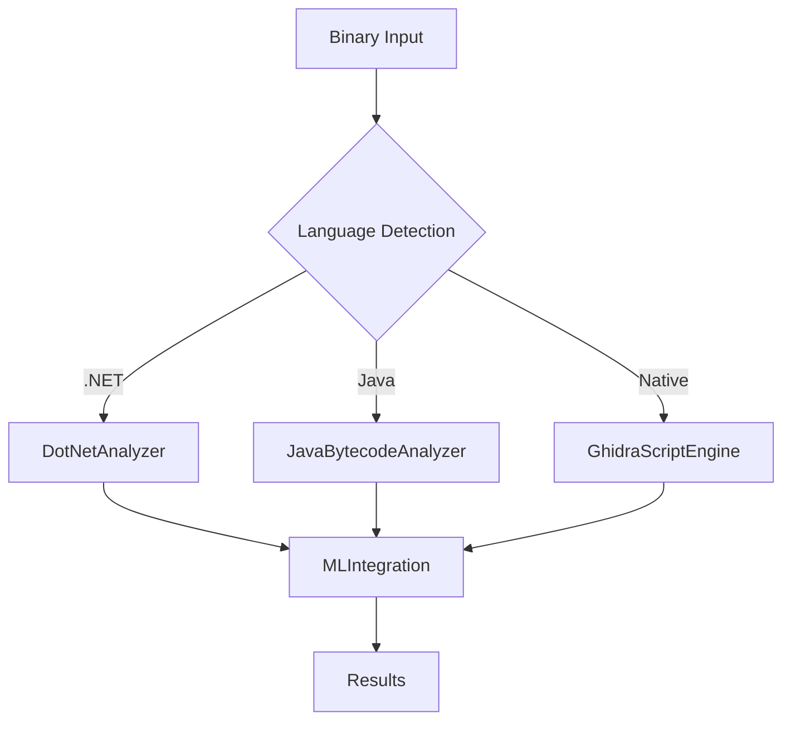

# Decision Matrix for AI Agents

## When to Use Which Tool

| Goal | Recommended Tool | Example |
|------|------------------|---------|
| Analyze .NET executable | `DotNetAnalyzer` | `from reveng.analyzers import DotNetAnalyzer` |
| Extract PE resources | `PEResourceExtractor` | `from reveng.pe import PEResourceExtractor` |
| Detect malware | `MLIntegration.detect_threats()` | `api.detect_malware(binary_path)` |
| Reconstruct binary | `MLCodeReconstruction` | `api.reconstruct_binary(binary_path)` |
| Quick analysis | `REVENGAPI.analyze_binary()` | `api.analyze_binary('/path/to/binary.exe')` |
| Enhanced analysis | `REVENGAPI.analyze_binary(enhanced=True)` | `api.analyze_binary('/path/to/binary.exe', enhanced=True)` |

## Tool Dependencies



## Common Workflows

### Workflow 1: Quick Malware Scan
```python
from reveng.api import REVENGAPI

api = REVENGAPI()
result = api.detect_malware('/suspicious.exe')
print(f"Threat Level: {result['threat_assessment']['threat_level']}")
```

### Workflow 2: Deep Analysis
```python
api = REVENGAPI(config={'enhanced': True})
result = api.analyze_binary('/target.exe', enhanced=True)
# result includes ML insights, code reconstruction, etc.
```

### Workflow 3: Binary Reconstruction
```python
api = REVENGAPI()
result = api.reconstruct_binary('/target.exe', output_format='c')
print(f"Source files: {result['reconstruction']['source_files']}")
```

## Tool Categories

### Core Analysis Tools
- **REVENGAPI**: Main entry point for all analysis
- **REVENGAnalyzer**: Legacy 12-step pipeline
- **MLIntegration**: AI-powered analysis

### Language-Specific Analyzers
- **DotNetAnalyzer**: .NET executables and libraries
- **JavaBytecodeAnalyzer**: Java JAR files and bytecode
- **PythonBytecodeAnalyzer**: Python compiled bytecode
- **NativeAnalyzer**: PE, ELF, Mach-O binaries

### Security Tools
- **MalwareClassifier**: ML-based malware detection
- **VulnerabilityPredictor**: Security vulnerability detection
- **ThreatIntelligenceCorrelator**: IOC correlation

### Reconstruction Tools
- **MLCodeReconstruction**: AI-powered code reconstruction
- **BinaryReassembler**: Binary reassembly
- **SourceCodeGenerator**: Source code generation

## Configuration Examples

### Basic Configuration
```python
config = {
    'timeout': 3600,
    'max_file_size_mb': 500,
    'output_directory': './analysis_output',
    'ai_provider': 'ollama'
}
api = REVENGAPI(config)
```

### Enhanced Configuration
```python
config = {
    'timeout': 7200,
    'max_file_size_mb': 1000,
    'output_directory': './enhanced_analysis',
    'ai_provider': 'claude',
    'enhanced': True,
    'modules': ['malware_detection', 'vulnerability_analysis']
}
api = REVENGAPI(config)
```

## Error Handling

```python
from reveng.core.exceptions import ValidationError, AnalysisError

try:
    result = api.analyze_binary('/path/to/binary.exe')
except ValidationError as e:
    print(f"Invalid input: {e}")
except AnalysisError as e:
    print(f"Analysis failed: {e}")
```

## Performance Tips

1. **Use appropriate file size limits**: Set `max_file_size_mb` based on available memory
2. **Enable enhanced analysis selectively**: Only use for critical binaries
3. **Configure timeout appropriately**: Large binaries need more time
4. **Use specific modules**: Specify `modules` parameter to run only needed analyzers

## Output Format

All tools return standardized JSON output with:
- **metadata**: File information and analysis metadata
- **classification**: Binary type and language detection
- **analysis**: Detailed analysis results
- **ml_insights**: AI-powered insights (if enhanced=True)
- **confidence**: Overall confidence score
- **errors/warnings**: Any issues encountered
