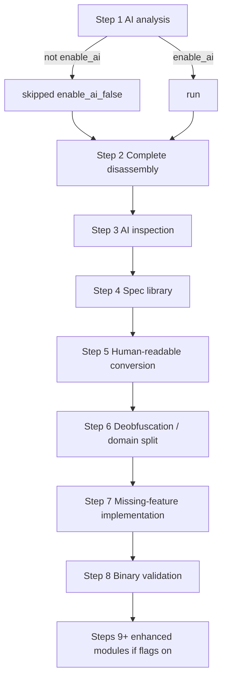

# Analysis pipeline (`REVENGAnalyzer`)

> **Maturity:** preview (product) · **limited** for deep native disassembly when Ghidra is required · CLI triage is **supported** in the [support matrix](../support/support-matrix.md)
>
> `enable_ai=False` skips AI steps and Ollama preflight; that is a real gate, not a silent no-op. See [AI providers](ai-providers.md) and [honesty rules](../support/honesty-rules.md).

This page is a high-level map of the **binary analyze** flow owned by `src/reveng/analysis/`. For managed-language apps (JS / JVM / Python / .NET), prefer [App RE dispatch](app-re-dispatch.md) instead of treating every input as a native `REVENGAnalyzer` job.

## Where it lives

| Piece | Path |
| --- | --- |
| Main orchestrator | `src/reveng/analysis/analyzer.py` — `REVENGAnalyzer`, `EnhancedAnalysisFeatures` |
| Domain subpackages | `src/reveng/analysis/{pe,native,lifting,deobfuscation,devirtualization,diffing,analyzers}/` |
| Step helpers used mid-pipeline | `src/reveng/pipeline/steps/` (vulnerability / threat-intel runners imported from the analyzer) |
| CLI wiring | `reveng.cli` → `handle_analyze_command` |

Breadcrumb: `src/reveng/analysis/claude.md`.

## Constructor knobs that matter

`REVENGAnalyzer.__init__` (`analyzer.py`):

- `binary_path` — target; resolved to an absolute path when set
- `analysis_folder` — default `analysis_{binary_name}`
- `enable_ai` — when `False`, skips AI steps 1/3, disables enhanced AI modules, and suppresses Ollama preflight
- `check_ollama` — only effective when `enable_ai` is true
- `enhanced_features` — `EnhancedAnalysisFeatures` flags for corporate exposure, vuln discovery, threat intel, reconstruction, demos
- `progress_callback` — structured progress events for UIs / MCP

## `analyze_binary()` step sketch

The core loop in `REVENGAnalyzer.analyze_binary` runs numbered steps, then optional enhanced modules:

| Step | Intent (as logged in code) | Notes |
| --- | --- | --- |
| 1 | AI-powered binary analysis | Skipped when `enable_ai=False` |
| 2 | Complete disassembly | Prefer Ghidra Analysis Server; local fallback paths exist; see [Ghidra boundary](ghidra-boundary.md) |
| 3 | AI inspection | Skipped when `enable_ai=False` |
| 4–7 | Specs, human-readable code, deobfuscation, implementation | Depend on earlier artifacts |
| 8 | Binary validation | If a rebuilt binary exists |
| 9+ | Enhanced modules | Only if `EnhancedAnalysisFeatures.is_any_enhanced_enabled()` |

Pipeline status is rolled up via `_calculate_pipeline_status()`. Later steps may import `reveng.pipeline.steps.run_vulnerability_discovery` / `run_threat_intelligence` — that is the **stage-engine** package, not `reveng.pipelines` templates ([pipeline vs pipelines](pipeline-vs-pipelines.md)).

## Subpackages under `analysis/`

Use these when you need domain depth rather than the orchestrator:

- `pe/` — PE-oriented helpers
- `native/` — native workflows (includes Ghidra-related pieces such as `ghidra_workflow.py`)
- `lifting/`, `deobfuscation/`, `devirtualization/`, `diffing/`, `analyzers/` — specialized transforms

## Honesty checkpoints

- Process exit 0 / step `completed` is **not** automatically native GA ([honesty rules](../support/honesty-rules.md), DF-5).
- Native fixtures under `test_samples/native/` are often **fixture_only** until analyze evidence is measured green ([maturity badges](../support/maturity-badges.md)).
- Do not invent success rates; cite matrix workflow status instead ([support matrix](../support/support-matrix.md)).

## Related

- [Architecture overview](architecture-overview.md)
- Engineer tutorial gates: `docs/tutorials/engineer/02-run-unit-and-honesty-gates.md`
- MCP / CLI may pass `enable_ai` and `quick_mode` into this class — see [Wire MCP tool](../how-to/engineer/wire-mcp-tool.md)
