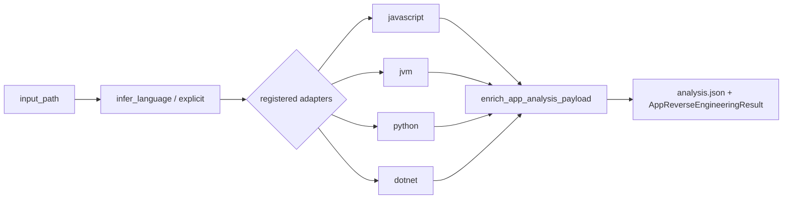

# App reverse-engineering dispatch

> **Maturity:** **supported** for JavaScript, JVM, Python, and .NET in the [support matrix](../support/support-matrix.md) · product overall remains **preview**
>
> Quality still varies by input shape and optional tools. Read validation / evidence / provenance on every result ([Reading validation grades](../support/reading-validation-grades.md) — **Ladder A**).

App reverse engineering is the corpus-gated multi-language path. It does **not** require Ghidra for managed-language inputs (see [Ghidra boundary](ghidra-boundary.md)).

## Core types

| Symbol | Module |
| --- | --- |
| `AppAdapter` (Protocol) | `src/reveng/app_reverse_engineering/framework.py` |
| `AppReverseEngineeringFramework` | same |
| `create_default_framework()` | `src/reveng/app_reverse_engineering/__init__.py` |
| `enrich_app_analysis_payload` / `build_validation_summary` | `src/reveng/app_reverse_engineering/contracts.py` |
| `AppReverseEngineeringResult` | `src/reveng/app_reverse_engineering/models.py` |
| Adapters | `src/reveng/app_reverse_engineering/adapters/` |

Breadcrumb: `src/reveng/app_reverse_engineering/claude.md`.

## Default registration (what actually ships)

`create_default_framework()` registers **only**:

1. `JavaScriptAppAdapter` — `adapters/javascript.py`
2. `JVMAppAdapter` — `adapters/jvm.py`
3. `PythonAppAdapter` — `adapters/python.py`
4. `DotNetAppAdapter` — `adapters/dotnet.py`

```python
# src/reveng/app_reverse_engineering/__init__.py (shape)
framework = AppReverseEngineeringFramework()
framework.register(JavaScriptAppAdapter())
framework.register(JVMAppAdapter())
framework.register(PythonAppAdapter())
framework.register(DotNetAppAdapter())
```

### `NativeAppAdapter` exists but is NOT default-registered

`NativeAppAdapter` lives in `src/reveng/app_reverse_engineering/adapters/native.py` and is documented in `adapters/claude.md`, but **`create_default_framework()` does not import or register it**. Callers that use the default framework will never dispatch to native via this path. Do not document native app-adapter support as GA because the class file exists — match `docs/support_matrix.json` languages for `app_reverse_engineering`.

To experiment with native, construct a framework yourself and `register(NativeAppAdapter())`, then treat it as research until the matrix and corpus say otherwise.

## Dispatch flow

1. **`infer_language(input_path)`** — walks registered adapters; first `supports_path(path)` wins; else `ValueError`.
2. **`reverse_engineer(..., language="auto"|explicit)`** — selects adapter; JavaScript gets extra kwargs (oracle / deobfuscator tool flags); others get the shared base kwargs.
3. **`enrich_app_analysis_payload(...)`** — attaches schema version, validation summary, evidence, provenance, optional JS probes.
4. **`rewrite_analysis_file`** — persists enriched `analysis.json`.
5. Result fields (`validation_grade`, `evidence`, `provenance`, …) are copied onto `AppReverseEngineeringResult`.



## Contracts juniors must keep intact

`contracts.py` is what makes app RE outputs comparable across languages:

- `schema_version` / `result_type` from `reveng.core.result_contracts.RESULT_SCHEMA_VERSION`
- Ladder A grades via `build_validation_summary` (`evidence_backed`, `partial_recovery`, `structure_only`, `packaging_only`)
- Evidence + provenance blocks for SPECS / analysis artifacts

JS may promote some grades when behavior probes pass — details in [Reading validation grades](../support/reading-validation-grades.md).

## Surfaces that call this path

- CLI: `reveng reverse-engineer-app` → `handle_reverse_engineer_app_command` in `reveng.cli`
- Console entry `reveng-app` → `reveng.app_reverse_engineering.cli`
- API: `reveng.api.reverse_engineer_app`
- MCP: servers import `create_default_framework()`

## Related

- How-to: [Add adapter](../how-to/engineer/add-adapter.md)
- [Result contracts](result-contracts.md)
- [Support matrix](../support/support-matrix.md)
