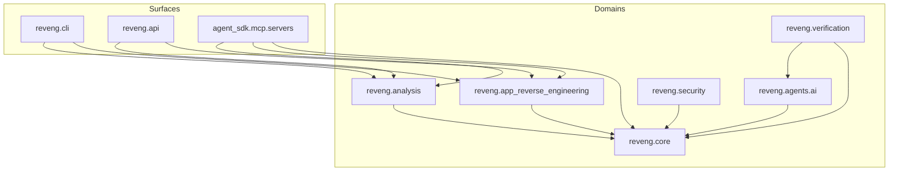

# Architecture overview

> **Maturity:** preview (product overall) · **supported** (app reverse engineering) · **limited** (Ghidra-backed native)
>
> Trust the [support matrix](../support/support-matrix.md) and [honesty rules](../support/honesty-rules.md) over any narrative claim. See [maturity badges](../support/maturity-badges.md).

REVENG (`reveng` 4.0.0) is a Python reverse-engineering platform. Analysis logic lives under `src/reveng/` and is exposed through **three surfaces** over one package: CLI, Python API, and MCP servers. Outcomes that leave the product should carry versioned validation / evidence / provenance fields from `reveng.core.result_contracts` (see [Result contracts](result-contracts.md)).

## Three surfaces

| Surface | Entry | Package / module |
| --- | --- | --- |
| CLI | `reveng` / `python -m reveng` | `reveng.cli` (`reveng.cli:main` in `pyproject.toml`); source-tree wrapper `src/reveng/cli/reveng.py` |
| Python API | `reveng.api`, helpers in `reveng.ai_api` | `src/reveng/api.py`, `src/reveng/ai_api.py` |
| MCP | agent SDK servers | `src/reveng/agent_sdk/mcp/servers/` (e.g. `reveng_server.py`, `reveng_enterprise_server.py`) |

There is **no** repo-root `reveng.py` launcher; that path was removed because it shadowed the package.

## Domain map

Layers are enforced by **import-linter** (`.importlinter`). Two load-bearing contracts:

- **`core-is-foundation`** — `reveng.core` must not import higher domains (`analysis`, `security`, `ai`, `agents`, `tools`, `agent_sdk`, `pipeline`, `app_reverse_engineering`, `javascript`, `verification`, …).
- **`security-must-not-import-ai`** — `reveng.security` must not import `reveng.ai` or `reveng.agents.ai`. Shared AI-shaped data models live in `reveng.core.ai_models` so that cycle stays broken.

| Domain | Role | Start reading |
| --- | --- | --- |
| `reveng.core` | Foundation: exceptions, error codes, validation, config, `result_contracts`, IR, `ai_models` | `src/reveng/core/` |
| `reveng.analysis` | Binary/source analysis; `REVENGAnalyzer` | [Analysis pipeline](analysis-pipeline.md) |
| `reveng.cli` | Console entry (`create_parser`, command handlers) | [Extend CLI](../how-to/engineer/extend-cli.md) |
| `reveng.app_reverse_engineering` | Language adapters + framework dispatch | [App RE dispatch](app-re-dispatch.md) |
| `reveng.verification` | VRL: differential oracle + iterative refine | [VRL and verification](vrl-and-verification.md) |
| `reveng.agent_sdk` | MCP tools/resources, skills | [Wire MCP tool](../how-to/engineer/wire-mcp-tool.md) |
| `reveng.agents.ai` | LLM providers (`get_analyzer`, Ollama / Anthropic / OpenAI / Claude CLI) | [AI providers](ai-providers.md) |
| `reveng.security` | Security tooling; must stay AI-import-free | [Security and exploits](security-and-exploits.md) |
| `reveng.pipeline` vs `reveng.pipelines` | Documented permanent split (R-PIPE-1) | [pipeline vs pipelines](pipeline-vs-pipelines.md) |

## What juniors should not assume

- A green local command is not a GA claim — open the tracked JSON and match the [support matrix](../support/support-matrix.md).
- Native PE/ELF analyze/recompile often needs Ghidra; managed-language app RE does not (see [Ghidra boundary](ghidra-boundary.md)).
- `fixture_only` samples and process `completed` are not native GA ([honesty rules](../support/honesty-rules.md)).
- App RE grades and VRL grades are **different ladders** ([Reading validation grades](../support/reading-validation-grades.md)).

## Related

- Breadcrumbs: `src/reveng/claude.md`, per-package `claude.md` files
- Contracts: `.importlinter`
- Ops / release honesty: `docs/ops/README.md`, skill `.cursor/skills/reveng-release-honesty/SKILL.md`
