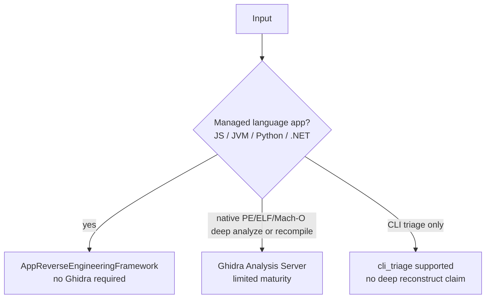

# Ghidra boundary

> **Maturity:** managed-language app RE **supported** without Ghidra · Ghidra-backed native analysis **limited** · native recompile **limited** (not GA-equivalent)
>
> Source of truth: [support matrix](../support/support-matrix.md) / `docs/support_matrix.json`. Honesty: [honesty rules](../support/honesty-rules.md).

Juniors often assume every path needs Ghidra. REVENG splits **managed app adapters** from **native / Ghidra-backed** analysis on purpose.

## When Ghidra is **not** required

Managed-language **app reverse engineering** uses adapters under `src/reveng/app_reverse_engineering/adapters/`:

| Language | Adapter | Default registered? |
| --- | --- | --- |
| JavaScript | `JavaScriptAppAdapter` | yes |
| JVM | `JVMAppAdapter` | yes |
| Python | `PythonAppAdapter` | yes |
| .NET | `DotNetAppAdapter` | yes |

`create_default_framework()` wires these only ([App RE dispatch](app-re-dispatch.md)). Matrix workflow `app_reverse_engineering` and the managed half of `source_binary_reconstruction` state that Java / Python / .NET-class inputs use **app adapters** and **do not require Ghidra**.

CLI: `reveng reverse-engineer-app` / `reveng-app`.

## When Ghidra **is** expected

| Workflow | Matrix status | Why |
| --- | --- | --- |
| `ghidra_backed_native_analysis` | **limited** | Deep native analysis via Ghidra Analysis Server / engine |
| Native PE / ELF / Mach-O **recompile** under `source_binary_reconstruction` | supported for managed; native side **limited** | Notes require a healthy Ghidra Analysis Server |

`REVENGAnalyzer` step 2 (`_step2_disassembly` in `src/reveng/analysis/analyzer.py`) prefers `reveng.integrations.ghidra.ghidra_engine.GhidraEngine`. Local disassembly fallbacks may exist, but they are not a license to claim native GA. Later steps that need decompiled functions (`ghidra_extractor`, `ghidra_analysis_data`) degrade when Ghidra data is missing.

Related packages:

- `src/reveng/integrations/ghidra/`
- `src/reveng/ghidra/`
- `src/reveng/analysis/native/` (e.g. `ghidra_workflow.py`)

## What is **not** the managed path

- `NativeAppAdapter` in `adapters/native.py` is **not** registered in `create_default_framework()` — do not treat it as the supported app RE surface.
- `test_samples/native/` fixtures often prove CLI byte-stability only (`fixture_only`) — not analyze GA ([maturity badges](../support/maturity-badges.md)).

## Practical decision tree

## Related

- [Analysis pipeline](analysis-pipeline.md)
- [App RE dispatch](app-re-dispatch.md)
- Analyst how-to (if present): `docs/how-to/analyst/` Ghidra-required pages
- [Support matrix](../support/support-matrix.md)
