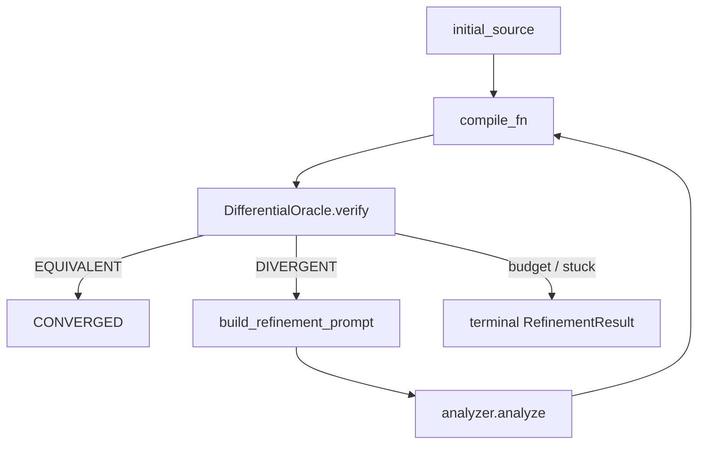

# VRL and verification

> **Maturity:** experimental / research-grade for end-to-end native convergence · **not** a substitute for supported app RE
>
> Use **Ladder B** grades only ([Reading validation grades](../support/reading-validation-grades.md)). Do not mix with app RE Ladder A. Product honesty: [honesty rules](../support/honesty-rules.md).

The Verified Recompilation Loop (VRL) lives under `src/reveng/verification/`. It drives **decompile → compile → differentially verify → LLM refine** toward behavioral equivalence — when the surrounding toolchain actually works.

## Main pieces

| Piece | Path |
| --- | --- |
| `IterativeRefiner` | `src/reveng/verification/refinement/refiner.py` |
| `DifferentialOracle` | `src/reveng/verification/differential/oracle.py` |
| Grade ladder (Ladder B) | `src/reveng/verification/models.py` — `VALIDATION_GRADE_LADDER` |
| End-to-end runner | `scripts/run_vrl.py` |
| Corpus grades | `.reveng/benchmarks/corpus.yaml` |

Breadcrumbs: `src/reveng/verification/claude.md`, `refinement/`, `differential/`.

## `IterativeRefiner` loop

Constructor is dependency-injected (no hard-wired compiler / provider):

- `analyzer` — object with `analyze(prompt) -> .content` (typically from `reveng.agents.ai.get_analyzer`)
- `compile_fn: Callable[[str], Path]` — compile C source to a binary path
- `oracle_factory: Callable[[Path], oracle]` — build a fresh differential oracle for the candidate binary
- `budget` — `RefinementBudget` (iteration / wall-clock / token caps)

`refine(initial_source, seed_inputs, argv=None)` roughly:

1. Compile / verify current source against the original via the oracle.
2. If verdict `EQUIVALENT` → `CONVERGED`.
3. If `DIVERGENT` → build a structured LLM prompt from the divergence (`prompts.py`).
4. Extract revised C, compile, re-verify with a **new** oracle instance.
5. Stop on convergence, budget exhaustion, or no-progress.



## `DifferentialOracle`

`DifferentialOracle.verify(inputs, argv=None)` runs original vs recompiled under the same inputs and compares **stdout + exit code** (stderr divergence is noted but not a failure). Grades are plain strings from Ladder B via `_grade_from_divergence_count`.

### Seed contract (argv vs stdin)

`scripts/run_vrl.py` classifies corpus seeds carefully:

- Items under `seed_inputs` / `test_inputs` are treated as **argv tokens** (CLI tools take flags/operands from argv).
- Explicit stdin payloads use a separate `stdin_inputs` list.
- The runner calls `refiner.refine(..., stdin_inputs, argv=seed_argv)`.

Do not assume “all seeds are stdin” — that misreads the corpus contract.

## Ladder B (VRL)

From `VALIDATION_GRADE_LADDER` in `models.py` (low → high):

`unknown` → `analysis_only` → `compile_only` → `structural_candidate` → `launches_but_divergent` → `partial_equivalence` → `behavior_matched` → `source_reconstruction_match` → `evidence_backed`

These are recorded into corpus / run logs for gates — they are **not** app RE grades.

## Runner: `scripts/run_vrl.py`

```bash
python scripts/run_vrl.py --binary hexyl --max-iterations 3
```

Environment: `REVENG_AI_PROVIDER` = `ollama` | `anthropic` | `openai` (default `ollama`). Workspaces land under `.reveng/vrl-runs/`. See [AI providers](ai-providers.md).

## Honesty: `fuzz_until_divergence` is NotImplemented

`DifferentialOracle.fuzz_until_divergence` is an explicit Phase 1 stub:

```python
raise NotImplementedError(
    "LibAFL integration scheduled for Phase 1.5. "
    "Use DifferentialOracle.verify(inputs) with a handcrafted corpus for Phase 1."
)
```

Docs and plans must **not** claim LibAFL fuzz-to-divergence works. Use handcrafted / corpus `verify()` inputs only.

## Related

- [Architecture overview](architecture-overview.md)
- [Result contracts](result-contracts.md)
- [Reading validation grades](../support/reading-validation-grades.md)
- [Support matrix](../support/support-matrix.md) — native reconstruction remains **limited** where Ghidra is required
